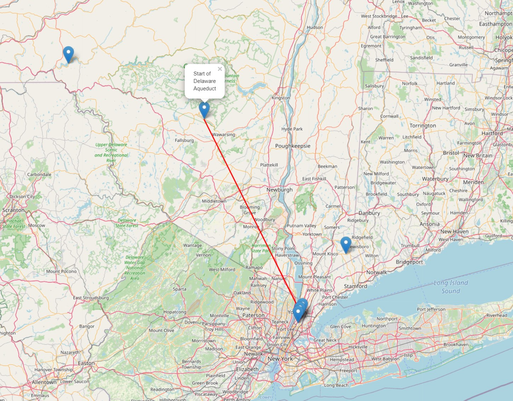
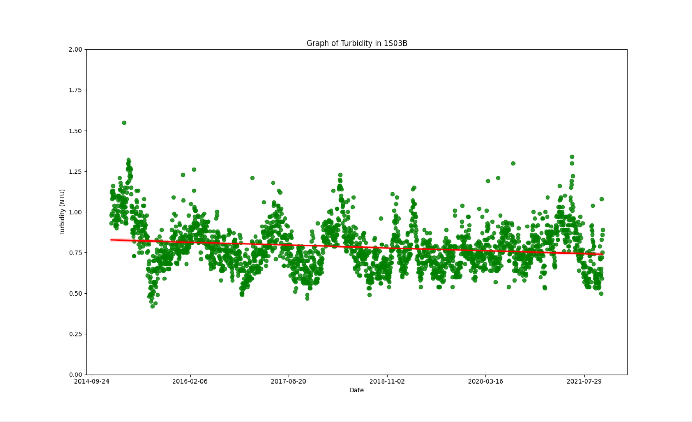
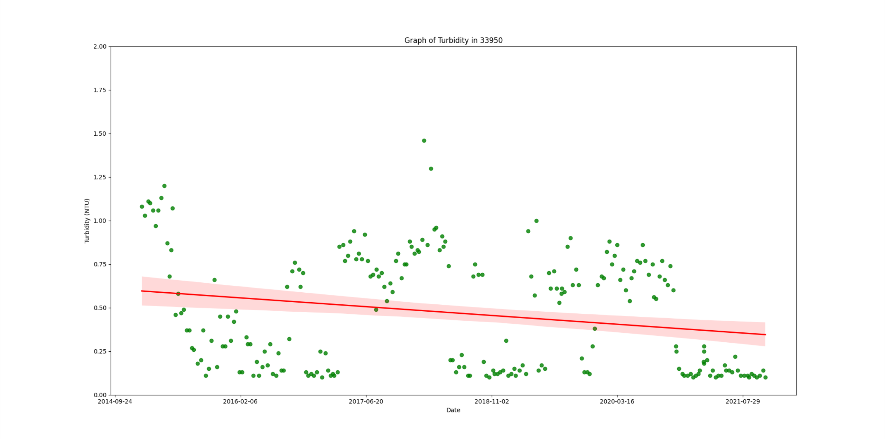
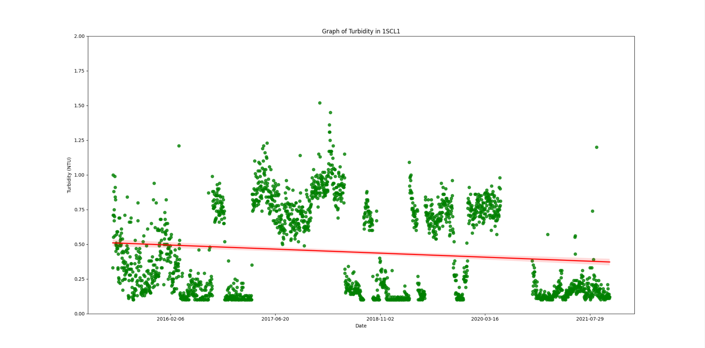

<h1>Jakub Czachor</h1> 
<h2>Project: Water Quality in NYC</h2> 
  <h3>Abstract: </h3> 
  My project will be looking at the water quality of NYC especially as the source of the water has changed recently as a result of the closure of the Catskill Aqueduct,   
  and how this can be used to make informed decisions on if the water quality in NYC needs further treatment when such closures happen.
  
   
   
   
 

  
     
   
   
   
  
  
  <h3>Methods:</h3> 
  
In order to test if the closures of the aqueducts have affected water quality, I would analyze the water turbidity data at multiple sampling points in New York City.  
  This information is freely available online for everybody, with the links provided below. I chose to analyze the 1S03B, 33950, and 1SCL1 testing sites because of their close proximity to the end of the Delaware Aqueduct as well as their proximity to the city. I began by cleaning up the data, and replacing the values of <.10 in the data with .10 in order to make analysis easier. My hypothesis was that because of the recent closures, and increase in complaints from people regarding the quality of the water, that there would be a noticable increase in the level of turbidity in the water. In order to test this hypothesis, I would run linear regressions on the data and figure out the current trend by finding the slope of the data.

   <h3>Analysis: </h3>      
   
   
   
   
  <h3> 
  
  
 
   
  <h3> 

Average Turbidity of 1S03B: 0.783551282051282 
Max Turbidity of 1S03B:  1.55 
Slope:  -3.502062579920943e-05 Intercept:  26.588376830008453 R Coef:  -0.17617771500352084 Standard Error:  3.918121922477679e-06 
  <p1> This data set is from the 1S03B Testing Site, which is located in Van Cortland Park in the Bronx. The general slope of the data is trending downwards, with a cyclic wave that is probably due to the seasons. There are a few values that are higher than in previous years, especially in the months of July, but I would not say thats definitive proof that the water turbidity has been wildly changing </p1>
     
   
   
   
  <h3> 
    
     
   
  <h3> 
  Average Turbidity of 33950: 0.46952991452991455 
Max Turbidity of 33950:  1.46 
Slope:  -0.00010090655415646666 Intercept:  74.82335186471137  R Coef:  -0.22429875286444997 Standard Error:  2.8783226342871914e-05
         
    <p1> This second data set is from the 33950 testing site, which is in East Harlem. This data shows an even clearer view of a downward trend throughout the years, with a seasonal change in the turbidity. In the past couple of months, the data shows that the turbidity has actually been at some of the lowest points since the data has been started.</p1>
   
   
   
  <h3> 
    
        
   
  <h3> 
Average Turbidity of 1SCL1: 0.46952991452991455 
Max Turbidity of 1SCL1:  1.46 
Slope:  -5.8137282401677444e-05 Intercept:  43.28282748538266  R Coef:  -0.11325207032188532 Standard Error:  1.0847035290399334e-05 
    <p1>This last data set is from the 1SCL1 testing site, which is in Harlem. The data is also trending downward, with a negative slope. There are a few recent outliers but there have been even bigger outliers in the past so I would argue that those are not statistically significant enough to prove our hypothesis. Once again, the levels of turbidity seem to depend more so on the season rather than the closure of the Delaware Aqueduct </p1>

    
         
   
   
   
  <h3> 
  
  <h3> Techniques: </h3> 
    <p1> In order to perform these analases, multiple Python packages were used. For the visualization of the map and the locations of the Delaware Aqueduct as well as the 3 testing sites, Folium was used. The map is centered around Hunter College, and displays a line showing the rough path of the Delaware Aqueduct. For the analysis of the data however, SciPy was used, along with Seaborn. Seaborn was used for the plotting of the data, while SciPy was used to find the slope, intercept, R coefficient and standard error. </p1>
  
  <h3> Citations: </h3>
https://data.cityofnewyork.us/Environment/Watershed-Water-Quality-Data/y43c-5n92  
https://data.cityofnewyork.us/Environment/Drinking-Water-Quality-Distribution-Monitoring-Dat/bkwf-xfky  
https://waterdata.usgs.gov/ny/nwis/qw/  
https://www1.nyc.gov/assets/nyw/downloads/pdf/nyw-2017-dep-water-report.pdf 
https://docs.scipy.org/doc/scipy/reference/generated/scipy.stats.linregress.html 
https://seaborn.pydata.org/generated/seaborn.regplot.html  
https://python-visualization.github.io/folium/quickstart.html

